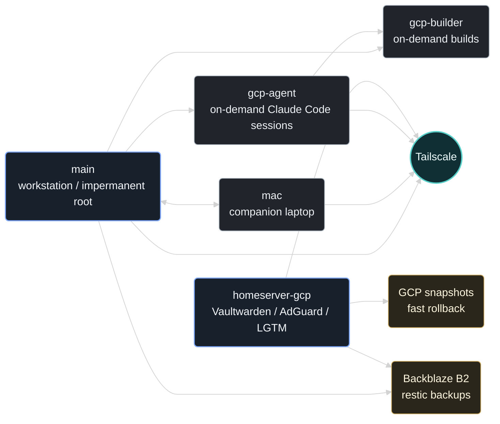

<h1>
  NixOS Fleet Flake
  
</h1>

A single, reproducible NixOS and Home Manager flake for a secure workstation, a
companion laptop, a cloud homeserver, and an on-demand remote builder.

This is not a generic starter template. It is working, multi-host personal
infrastructure, published to a quality bar that documents the patterns, checks,
and operational boundaries needed to keep real machines reproducible over time.
The reusable building blocks are exposed through stable flake outputs; the host
assemblies stay personal and hardware-bound. For the fleet topology in one
glance, jump to the [System At A Glance](#system-at-a-glance) diagram; for what
to take from this repo, start at [Reusable Outputs](#reusable-outputs) and
[What To Copy First](#what-to-copy-first) below.

First time here? Clone the repo and run `nix run .#doctor` — it walks a clean
checkout through the same documentation, evaluation, and formatting checks
`merge-gate` runs, explaining each one in plain terms (missing Nix, an
unsupported platform, dirty formatting, a broken doc link, an evaluation
error) so you can tell a real problem from noise before going further.

---

## Reusable Outputs

| Output                              | What it gives you                                                                            |
| :---------------------------------- | :------------------------------------------------------------------------------------------- |
| `nixosModules.services-hardened`    | Systemd sandboxing DSL with forced baselines, explicit relaxations, and tests.               |
| `nixosModules.observability-stack`  | Grafana, Mimir, Loki, Tempo, blackbox probes, dashboards, and alerts as Nix.                 |
| `nixosModules.observability-client` | Client-side collectors and authenticated remote shipping into the observability stack.       |
| `homeModules.runtime-theme`         | Runtime theme switching for Waybar, Kitty, Mako, Hyprland, GTK, and Neovim.                  |
| `lib/hosts.nix` + `lib/acl.nix`     | Host registry and generated Tailscale ACLs from one fleet source of truth.                   |
| `checks` + `tests`                  | Public invariants for hardening, persistence, backups, registry drift, and module contracts. |

The public adoption plan tracks what is reusable today, what still needs
examples, and what should remain personal reference infrastructure:
[`docs/public-adoption.md`](docs/public-adoption.md).

## What To Copy First

If you are borrowing from this repo, start with the reusable outputs instead of
the host directories:

1. `nixosModules.services-hardened` if you want a tested systemd hardening
   baseline for existing NixOS services.
2. `nixosModules.observability-stack` and `observability-client` if you want a
   declarative single-node LGTM stack with remote collectors.
3. `homeModules.runtime-theme` if your desktop stack is Hyprland, Waybar, Kitty,
   Mako, and Hyprlock.
4. `lib/hosts.nix` and `lib/acl.nix` as a pattern for keeping deploy metadata,
   inventory, and Tailscale policy in one source of truth.

Want to see what the registry pattern produces before adopting it? Two
generated, sanitized samples are committed and reproducible from a clean clone:
[`docs/samples/inventory.sample.json`](docs/samples/inventory.sample.json)
(`nix run .#inventory-json`) and
[`docs/samples/tailscale-acl.sample.json`](docs/samples/tailscale-acl.sample.json)
(`nix run .#tailscale-acl`) — see
[`docs/public-adoption.md`](docs/public-adoption.md#sample-artifacts) for the
exact regeneration command.

Treat `hosts/` as reference implementation: disk layouts, hardware configs,
hostnames, secrets, and deploy targets are intentionally personal. Issues and
PRs are welcome for the reusable pieces above; treat anything under `hosts/` as
read-only reference rather than something this project will adapt to your
hardware — see [Support Boundary](#support-boundary).

---

## System At A Glance



| Host             | Role                | Highlights                                                                                       |
| :--------------- | :------------------ | :----------------------------------------------------------------------------------------------- |
| `main`           | Primary workstation | Secure Boot, LUKS, impermanent root, Hyprland, USBGuard, Restic/B2, anonymous specialisation     |
| `mac`            | Companion laptop    | NixOS on a 2017 MacBook Air, Broadcom Wi-Fi, impermanence, Syncthing, Input Leap, Moonlight      |
| `homeserver-gcp` | Cloud homeserver    | Vaultwarden, AdGuard, Nginx, Grafana/Loki/Mimir/Tempo, restore canary, Tailscale ingress         |
| `gcp-builder`    | Remote builder      | Normally off, started for heavy builds, self-powers-off when idle, deploy-rs managed             |
| `gcp-agent`      | Claude Code agent   | Normally off, started for issue-loop sessions, narrow sudo, own claude login + scoped GitHub PAT |
| `user@wsl`       | Portable HM profile | Home Manager profile for Windows/WSL environments                                                |

Host lifecycle status is owned by `lib/hosts.nix`; this table documents that
registry. `installer` is a utility ISO outside the host registry.

---

## What Makes This Different

- **Impermanent workstation with explicit persistence.** `main` rolls its root
  back to a blank Btrfs snapshot on every boot. Host identity, service state,
  backups, Secure Boot material, and selected desktop state are deliberately
  persisted on `/persist`; everything else is regenerated declaratively.
- **A real secrets and deployment model.** sops-nix, deploy-rs, disko,
  Tailscale, TPM + initrd-SSH LUKS recovery, and per-host runbooks are wired
  into one flake. Encrypted secrets are committed; private keys and live
  credentials are not.
- **Self-hosted observability as code.** Grafana, Mimir, Loki, Tempo,
  Alertmanager, blackbox probes, dashboards, and alert rules are configured
  declaratively, with client hosts shipping over authenticated `/obs/*` routes.
  Because every on-box alerting component dies with the VM, an off-box
  dead-man's-switch pings an external healthcheck so total host death is still
  noticed.
- **Security policy that is testable.** Custom Nix invariants check fail2ban,
  persisted backup paths, host-registry assumptions, plaintext-secret
  boundaries, and service hardening expectations as part of CI.
- **Backups that are proven, not assumed.** A daily restore canary restores a
  known marker from B2 _and_ restores the Vaultwarden database to run
  `PRAGMA integrity_check`, emitting freshness metrics; weekly integrity checks
  and stale alerts catch silent drift; invariants enforce the contract.
- **A single source of truth for the fleet.** `lib/hosts.nix` drives deploy
  targets, Tailscale ACLs, backup policy, observability labels, and inventory
  export — host metadata is defined once, not scattered across files.

---

## Reusable Patterns

The pieces below are extracted with clean option boundaries, tests or fixtures,
and a documented public contract. They work without importing the personal host
configuration.

### Systemd hardening DSL — `nixosModules.services-hardened`

`services.hardened` applies a strong sandbox baseline to selected systemd
services while allowing explicit, auditable per-service relaxations:

```nix
services.hardened.nginx = {
  relaxBase = [ "MemoryDenyWriteExecute" ];
  extraConfig.AmbientCapabilities = "CAP_NET_BIND_SERVICE";
};
```

Forced settings win unless named in `relaxBase`; `extraConfig` overrides
non-forced defaults; null values are rejected. See
[`docs/modules/services-hardened.md`](docs/modules/services-hardened.md).
Files: `modules/nixos/services/hardened.nix`,
`tests/lib/services-hardened.nix`.

### Declarative observability — `nixosModules.observability-stack` / `observability-client`

The `profiles.observability` stack provisions Grafana, Mimir, Loki, Tempo,
Alertmanager, blackbox probes, dashboards, alert rules, and local collectors
from Nix, in either a local single-node mode or a remote-client mode that pushes
to a central stack. Secrets are read from runtime files, never rendered into the
Nix store. See [`docs/observability-stack.md`](docs/observability-stack.md).
Files: `modules/nixos/profiles/observability/`,
`modules/nixos/profiles/observability-client.nix`, `lib/dashboards.nix`,
`lib/observability-alerts.nix`.

### Host registry as source of truth

Host metadata lives in `lib/hosts.nix` and is consumed by deploy outputs,
Tailscale ACL generation, backup policy, observability labels, and the inventory
export — avoiding the drift that comes from duplicating network identity, roles,
and lifecycle status across unrelated files. See
[`docs/host-registry.md`](docs/host-registry.md).
Files: `lib/hosts.nix`, `lib/acl.nix`, `packages/inventory-data.nix`,
`flake/hosts.nix`, `flake/deploy.nix`.

### Generated Tailscale ACLs

`lib/acl.nix` turns the host registry into an `acl.hujson`-compatible policy:
it maps tags to owners, emits explicit tag-to-tag port rules from `acceptFrom`,
keeps `autogroup:admin` as deliberate break-glass, and rejects an `acceptFrom`
source tag that no host carries. A scheduled workflow checks the generated
policy against the live tailnet. See
[`docs/tailscale-acl.md`](docs/tailscale-acl.md).

### Runtime theming — `homeModules.runtime-theme`

Waybar, Kitty (including its ANSI palette), Mako, Hyprland, Hyprlock, GTK, and
Neovim all source colors generated by Nix from a central theme file. Nix renders
every theme's assets at build time and ships a `theme-switch` runtime switcher
that only relinks those pre-generated assets — so a rebuild and a runtime switch
always produce identical colors. See [`docs/theme.md`](docs/theme.md).

### Impermanence with guardrails

`main` uses a rollback-root boot flow: runtime state only survives if it lives
on `/home`, `/nix`, `/persist`, or is regenerated declaratively. Checks verify
that every backup path is persisted or inherently persistent, so adding a Restic
path that would vanish after reboot fails validation.
Files: `hosts/main/impermanence.nix`,
`modules/nixos/profiles/impermanence-base.nix`, `flake/checks.nix`.

---

## Flake Outputs

```bash
# Apps — run from a clean clone
nix run .#doctor           # clean-clone documentation, eval, and format checks
nix run .#control-center   # GTK4 Wayland control panel
nix run .#tailscale-acl    # print the generated Tailscale ACL JSON
nix run .#inventory-json   # print the generated host inventory JSON

# Packages
nix build .#control-center
nix build .#tailscale-acl
nix build .#inventory-data
nix build .#installer-iso

# Template
nix flake init -t .#python  # Python dev shell with uv, ruff, basedpyright
```

Modules exposed for reuse:

```nix
nixosModules = {
  services-hardened       = ./modules/nixos/services/hardened.nix;
  observability-stack     = ./modules/nixos/profiles/observability;
  observability-client    = ./modules/nixos/profiles/observability-client.nix;
  profiles-base           = ./modules/nixos/profiles/base.nix;
  profiles-desktop        = ./modules/nixos/profiles/desktop.nix;
  profiles-security       = ./modules/nixos/profiles/security.nix;
};

homeModules = {
  neovim                  = ./home/neovim/module.nix;
  runtime-theme           = ./home/theme/module.nix;
  profiles-base           = ./home/profiles/base.nix;
  profiles-desktop        = ./home/profiles/desktop.nix;
  profiles-workflow-packs = ./home/profiles/workflow-packs;
};
```

Two dev shells are provided: `default` (deploy-rs, nixos-anywhere, sops, nixd,
and the pre-commit toolchain) and `security` (network/web/password/analysis
tooling; `proxychains <tool>` routes through Tor in the anonymous
specialisation).

---

## Repository Layout

```text
.
├── flake.nix          # Flake entry point and public outputs
├── flake/             # Host, deploy, dev-shell, and check wiring
├── hosts/             # Hardware-bound host assemblies and per-host runbooks
├── modules/nixos/     # Reusable NixOS profiles, services, hardware modules
├── home/              # Home Manager modules, profiles, dotfiles, themes
├── packages/          # Repo-owned packages and generated artifacts
├── lib/               # Pure helpers: host registry, ACLs, dashboards, invariants
├── tests/             # Pure tests, fixtures, and NixOS profile tests
├── scripts/           # Validation, deployment, CI planning, drift checks
├── templates/         # Flake templates (Python dev shell)
├── docs/              # Architecture, operations, security, restore drills
└── infra/             # Cloud infrastructure for homeserver rollback support
```

Adding a host: add an entry to `lib/hosts.nix` (role, system, Home Manager and
backup metadata), create `hosts/<name>/default.nix` from the appropriate
profiles, document any checked-in `hardware-configuration.nix` with a regeneration
header, and add the host's sops recipient and secrets. See
[`docs/architecture.md`](docs/architecture.md) for the layering rules.

---

## Deployment

| Host             | Command                                  | Notes                                                                                           |
| ---------------- | ---------------------------------------- | ----------------------------------------------------------------------------------------------- |
| `main`           | `nh os switch --hostname main .`         | Active impermanent workstation rebuild.                                                         |
| `mac`            | `deploy '.#mac'`                         | Companion workstation; `nh os switch --hostname mac .` also works.                              |
| `homeserver-gcp` | `deploy '.#homeserver-gcp'`              | Active GCP homeserver; see `scripts/deploy-gcp.sh` for provisioning.                            |
| `gcp-builder`    | `deploy '.#gcp-builder'`                 | On-demand remote builder; start the VM first. See its `CLAUDE.md`.                              |
| `gcp-agent`      | reprovision / manual activation          | On-demand Claude Code agent; narrow sudo, so no deploy-rs auto-activation. See its `CLAUDE.md`. |
| `user@wsl`       | `home-manager switch --flake .#user@wsl` | Portable Home Manager for WSL.                                                                  |

`scripts/deploy-gcp.sh` is for provisioning/reinstall only (Terraform apply +
`nixos-anywhere`), not an ongoing-deploy alias. See
[`docs/operations.md`](docs/operations.md) for the full deploy and recovery
runbook.

---

## Validation

Expected to work from a clean clone, with no hardware or secrets:

```bash
bash scripts/validate.sh flake-eval   # fast evaluation gate (nix flake check --no-build)
bash scripts/validate.sh docs         # Markdown link check
bash scripts/validate.sh light        # deploy checks, invariants, sops bootstrap, lib tests
bash scripts/doctor.sh                # clean-clone documentation/eval/format bundle
nix fmt -- --fail-on-change           # treefmt-nix formatting check
bash scripts/validate.sh package all  # build CI package outputs and the installer ISO
```

Requires extra local capability:

- NixOS smoke/profile tests require KVM (`bash scripts/validate.sh heavy`).
- Switching `main`, `mac`, or `homeserver-gcp` requires the corresponding
  hardware, credentials, and sops access.
- Publishing to the binary cache requires CI secrets.

`nix flake check` here is intentionally evaluation-oriented: booted NixOS tests
and CVE reports live under `legacyPackages` so path-gated CI can skip the
expensive jobs. Formatting is unified behind `nix fmt` via `treefmt-nix`, and
`nix develop` installs the pre-commit hook set (treefmt, shellcheck, statix,
deadnix, and a high-signal plaintext-secret detector).

---

## Continuous Integration

GitHub Actions path-filters work via `scripts/ci-plan.sh`: dependency and core
changes (`flake.nix`, `flake.lock`, `lib/`, CI wiring) run the full suite, while
role-specific changes only build the affected host closures and tests, and
docs-only changes run lint and link checks. A single `merge-gate` status
consolidates flake evaluation, light checks, package builds, host builds, and
selected smoke/profile tests for branch protection; weekly `flake.lock` updates
auto-merge when it passes. CI substitutes from a signed Cloudflare R2 binary
cache but only publishes on protected `main`.

---

## Documentation

**Architecture & operations**

- [Architecture](docs/architecture.md) — layer boundaries, global imports, and host-registry rules.
- [Operations](docs/operations.md) — deployment, validation, and recovery runbook.
- [Host Registry](docs/host-registry.md) — the host metadata schema and its consumers.
- [Remote Builder](docs/remote-builder.md) — on-demand cloud Nix builder: offload, idle self-shutdown, trust boundary.

**Security & backups**

- [Security Model](docs/security.md) — sops recipients, initrd SSH, Tailscale exposure, USBGuard, and hardening.
- [Backup Validation](docs/backup-validation.md) — proven-restore pattern: retention, freshness metrics, restore canary, invariants.
- [Restore Drill](docs/restore-drill.md) — quarterly manual restore from the B2 restic repository.

**Subsystems**

- [Systemd Hardening DSL](docs/modules/services-hardened.md) — the `services.hardened` option contract.
- [Observability Stack](docs/observability-stack.md) — LGTM stack modes and ingest routes.
- [Tailscale ACLs](docs/tailscale-acl.md) — metadata contract, validation, and drift detection.
- [Theming](docs/theme.md) — runtime color contract and public module usage.
- [Neovim](docs/neovim.md) — editor module layout and generated-config contract.
- [Public Adoption](docs/public-adoption.md) — reusable contract, example-fleet plan, and public-facing priorities.

**Roadmap**

- [Roadmap & Backlog](docs/goals/roadmap.md) — cross-cutting deferred work.
- [MacBook Goals](docs/goals/macbook-goals.md) — companion workstation topology,
  roadmap, and follow-ups.

Host-local runbooks (gotchas, recovery, install) live next to each host's
config: [`hosts/main/CLAUDE.md`](hosts/main/CLAUDE.md),
[`hosts/mac/CLAUDE.md`](hosts/mac/CLAUDE.md),
[`hosts/homeserver-gcp/CLAUDE.md`](hosts/homeserver-gcp/CLAUDE.md),
[`hosts/gcp-builder/CLAUDE.md`](hosts/gcp-builder/CLAUDE.md),
[`hosts/gcp-agent/CLAUDE.md`](hosts/gcp-agent/CLAUDE.md).

---

## Support Boundary

This is personal infrastructure maintained to a publishable quality bar, not a
drop-in NixOS distribution.

- `x86_64-linux` is the only supported system today.
- You can reuse the modules, packages, tests, and structure freely. You should
  expect to edit host-registry entries, disk layouts, hardware configs, secrets,
  and network identity before reusing any host assembly directly.
- Disk provisioning and reinstall workflows are destructive and operator-only;
  review the target device before running `disko` or `nixos-anywhere`.

---

## License & Security

- [`LICENSE`](LICENSE) — repository content is published under the MIT license.
- [`SECURITY.md`](SECURITY.md) — private vulnerability disclosure intake.
