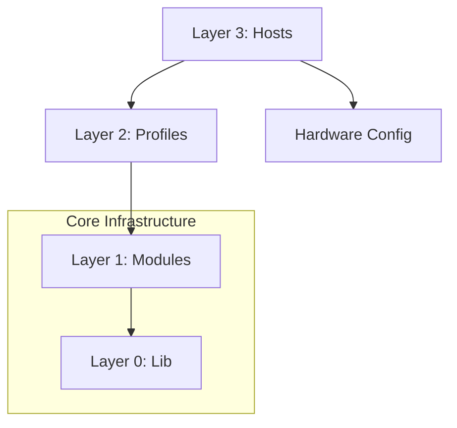

# Repository Architecture

This document defines the structural hierarchy and "Rules of Engagement" for the NixOS flake. Adhering to these rules prevents "topology bugs"—such as headless hosts inheriting desktop closures—and ensures the codebase remains scalable.

---

## 1. Structural Hierarchy

The configuration is organized into four distinct layers, with dependencies only flowing **downward**.

| Layer                 | Location                                           | Responsibility                                             | Side Effects?   |
| :-------------------- | :------------------------------------------------- | :--------------------------------------------------------- | :-------------- |
| **Layer 3: Hosts**    | `hosts/`                                           | Final assembly. Combines hardware, identity, and profiles. | **High**        |
| **Layer 2: Profiles** | `modules/nixos/profiles/`                          | Bundles modules into logical features (e.g., "Desktop").   | **High**        |
| **Layer 1: Modules**  | `modules/nixos/services/`, option-focused profiles | Defines custom options and internal logic (DSL).           | **Conditional** |
| **Layer 0: Lib**      | `lib/`                                             | Pure logic, registries, and schema definitions.            | **None**        |

---

## 2. Dependency Graph

---

## 3. Rules of Engagement

### Rule 1: The "Side-Effect" Gate

Files that have **unconditional side-effects** (e.g., adding packages to `environment.systemPackages` or enabling heavy services for every host) **MUST NOT** be imported globally in `modules/nixos/default.nix`.

- **Manual Opt-in:** Side-effectful NixOS profiles like `desktop.nix` and hardware modules like `hardware/nvidia-prime.nix` must be imported explicitly by the host. Home Manager workflow packs are enabled through host metadata in `lib/hosts.nix`, not by global NixOS imports.
- **Host-specific Home Manager overlays:** small per-host user modules such as
  `home/users/user/main.nix` and `home/users/user/mac.nix` are imported by the
  host assembly layer when the host name matches. Use these for workstation
  companion apps and aliases that should not leak into every desktop.
- **Global Infrastructure:** Globally imported files must either define reusable options or gate their effects behind explicit options/host metadata. The current global imports are `profiles/observability/`, `profiles/backup.nix`, `services/systemd-failure-notify.nix`, and `services/hardened.nix`.
- **Conditional Global Profiles:** A profile such as `backup.nix` may be global only because it is inert unless `hostMeta.backup.class` is set.

### Rule 2: Closure Integrity

A host's Nix store closure should only contain what is explicitly requested.

- **Headless Safety:** Headless hosts (like `homeserver-gcp`) must never inherit GUI libraries or X11/Wayland dependencies.
- **Verification:** Use `nix build '.#checks.x86_64-linux.invariants-<host>'` to verify that unauthorized profiles haven't leaked into a host.

### Rule 3: Single Source of Truth (Registry)

`lib/hosts.nix` is the **Single Source of Truth (SSoT)** for host metadata.

- **Multi-Arch Support:** Every host must define its target `system` (e.g., `x86_64-linux`), ensuring the flake evaluates correctly for heterogeneous fleets.
- **Lifecycle Status:** Every host in `lib/hosts.nix` must define `status`. `active` means a current runtime target, `inactive` means buildable but not operated, and `legacy-supported` means retained tooling with an explicit maintenance boundary.
- Network IDs, Tailscale tags, and roles must be defined in the registry, not hardcoded in modules.
- Hosts and infrastructure modules receive this data through the `hostMeta` and `hostRegistry` special args. Avoid duplicating registry-owned values in host modules unless the local value is truly hardware-specific.
- Generators may intentionally consume only a subset of the registry. For example, `lib/acl.nix` consumes `tailscale` metadata needed for explicit host:port policy (`tag`, `acceptFrom`, and `tailnetFQDN` when present) rather than inferring service exposure from host modules.

### Rule 4: Module vs. Profile

- **Modules** (`modules/nixos/services/`) define _how_ a service works and provide a DSL (e.g., `services.hardened`). They should be generic and reusable.
- **Profiles** (`modules/nixos/profiles/`) define _what_ is enabled. They set the policy for the fleet (e.g., "All desktop machines use Hyprland and PipeWire").

---

## 4. Layer Definitions

### Layer 0: Lib

Pure Nix functions. These must be "cold" (no imports of system modules). They define the schema for the rest of the flake.

### Layer 1: Modules

The building blocks. These introduce new attributes to the `services` or `programs` namespace. They should use `lib.mkIf` to ensure they do nothing unless their specific `.enable` option is set.

Current examples:

- `modules/nixos/services/hardened.nix` defines the `services.hardened` DSL.
- `modules/nixos/services/systemd-failure-notify.nix` defines failure notification options.
- `modules/nixos/profiles/observability/` defines the observability option surface and implementation, but remains inert unless `profiles.observability.enable = true`. It is exposed publicly as `nixosModules.observability-stack`; remote shipping is exposed as `nixosModules.observability-client`.

### Layer 2: Profiles

The "Features" of the system. A profile typically imports multiple modules and configures them to work together. Profiles are the primary unit of reuse between hosts.

### Layer 3: Hosts

The entry points. A host file should be a "thin" composition of:

1.  Hardware configuration (`hardware-configuration.nix`).
2.  Disk layout (`disko.nix`).
3.  A list of Profile imports.
4.  Host-specific secrets and identity.

Hand-maintained `hardware-configuration.nix` files must carry a short header
with their regeneration policy and a `Last reviewed: YYYY-MM-DD` note so it is
obvious when a checked-in hardware snapshot should be regenerated or manually
revalidated.

## 5. Local Package Boundary

Desktop applications that need custom runtime wrapping but are still repo-owned
should live under `packages/` and be exposed through flake `packages` and, when
useful, flake `apps`.

Current example:

- `packages/control-center/` owns the GTK4 control center source tree and its
  runtime wrapper; Home Manager should consume the packaged output instead of
  embedding a standalone `home/files/scripts/control_center.py` copy.
