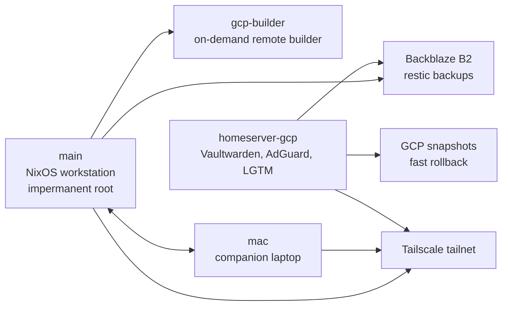

# NixOS Fleet Flake

Production-style NixOS and Home Manager infrastructure for a secure workstation,
companion laptop, cloud homeserver, and on-demand remote builder.

This repository is not a generic starter template. It is a working, multi-host
NixOS system that documents the patterns, checks, and operational boundaries
needed to keep real machines reproducible over time.

## Why This Is Worth Reading

- **Impermanent workstation with explicit persistence**: root rolls back on every
  boot, while host identity, service state, backups, Secure Boot material, and
  selected desktop state are deliberately persisted.
- **Secrets and deployment model for real hosts**: sops-nix, deploy-rs, disko,
  Tailscale, initrd SSH recovery, and host-specific runbooks are wired into one
  flake.
- **Self-hosted observability as code**: Grafana, Mimir, Loki, Tempo,
  Alertmanager, blackbox probes, audit streams, dashboards, and alert rules are
  configured declaratively.
- **Security policy is testable**: custom Nix invariants check fail2ban,
  persisted backup paths, host registry assumptions, plaintext secret boundaries,
  and service hardening expectations.
- **Reusable modules and packages**: includes a systemd hardening DSL,
  observability profiles, host inventory export, Tailscale ACL generation, a
  packaged Wayland control center, and a Python dev-shell template.

## System At A Glance



| Host             | Role                | Highlights                                                                                   |
| :--------------- | :------------------ | :------------------------------------------------------------------------------------------- |
| `main`           | Primary workstation | Secure Boot, LUKS, impermanent root, Hyprland, USBGuard, Restic/B2, anonymous specialisation |
| `mac`            | Companion laptop    | NixOS on 2017 MacBook Air, Broadcom Wi-Fi, impermanence, Syncthing, Input Leap, Moonlight    |
| `homeserver-gcp` | Cloud homeserver    | Vaultwarden, AdGuard, Nginx, Grafana/Loki/Mimir/Tempo, restore canary, Tailscale ingress     |
| `gcp-builder`    | Remote builder      | Normally off, started for heavy builds, deploy-rs managed                                    |
| `user@wsl`       | Portable HM profile | Home Manager profile for Windows/WSL environments                                            |

## Reusable Patterns

### Impermanence With Guardrails

`main` uses a rollback-root boot flow: the previous root is moved aside and a
blank Btrfs snapshot becomes the new root on every boot. Runtime state only
survives if it lives on `/home`, `/nix`, `/persist`, or is regenerated
declaratively.

The repo does not rely on memory or discipline alone. Checks verify that backup
paths are either persisted or inherently persistent, so adding a new Restic path
that would disappear after reboot fails validation.

Relevant files:

- `hosts/main/impermanence.nix`
- `modules/nixos/profiles/impermanence-base.nix`
- `flake/checks.nix`
- `docs/security.md`

### Systemd Hardening DSL

The `services.hardened` module applies a strong baseline to selected systemd
services while still allowing explicit per-service relaxations.

```nix
services.hardened.nginx = {
  relaxBase = [ "MemoryDenyWriteExecute" ];
  extraConfig = {
    AmbientCapabilities = "CAP_NET_BIND_SERVICE";
  };
};
```

This keeps hardening policy centralized without pretending every daemon can run
under exactly the same sandbox.

Relevant files:

- `modules/nixos/services/hardened.nix`
- `docs/security.md`
- `tests/nixos/profile-security.nix`

### Declarative Observability

The `profiles.observability` stack provisions Grafana, Mimir, Loki, Tempo,
Alertmanager, blackbox probes, dashboards, alert rules, and local collectors
from Nix.

Client hosts can push metrics, logs, and traces to the homeserver over
authenticated `/obs/*` routes. Secrets are read from runtime files instead of
being rendered into the Nix store.

Relevant files:

- `modules/nixos/profiles/observability/`
- `modules/nixos/profiles/observability-client.nix`
- `hosts/homeserver-gcp/grafana.nix`
- `hosts/homeserver-gcp/dashboards.nix`
- `lib/dashboards.nix`
- `lib/observability-alerts.nix`

### Host Registry As Source Of Truth

Host metadata lives in `lib/hosts.nix` and is consumed by deploy outputs,
Tailscale ACL generation, backup policy, observability labels, homepage
inventory export, and invariants.

This avoids scattering network identity, role metadata, lifecycle status, and
host architecture across unrelated files.

Relevant files:

- `lib/hosts.nix`
- `lib/acl.nix`
- `packages/inventory-data.nix`
- `flake/hosts.nix`
- `flake/deploy.nix`

### CI That Matches The Repo Shape

The flake separates cheap evaluation, docs checks, package builds, CI-only VM
tests, security scans, and path-gated workflows. Clean-clone validation is a
first-class target rather than a best-effort local habit.

```bash
bash scripts/validate.sh flake-eval
bash scripts/validate.sh docs
bash scripts/validate.sh light
bash scripts/test-ci-plan.sh
bash scripts/check-secrets-directory.sh --working-tree
nix fmt -- --fail-on-change
```

Relevant files:

- `.github/workflows/nix.yml`
- `.github/workflows/cve-scan.yml`
- `.github/workflows/flake-update.yml`
- `scripts/validate.sh`
- `scripts/ci-plan.sh`
- `tests/`

## Flake Outputs

Selected outputs intended to be useful from a clean clone:

```bash
nix run .#doctor
nix run .#control-center
nix build .#control-center
nix build .#inventory-data
nix build .#tailscale-acl
nix build .#installer-iso
```

Modules exposed by the flake:

```nix
nixosModules = {
  profiles-base = ./modules/nixos/profiles/base.nix;
  profiles-desktop = ./modules/nixos/profiles/desktop.nix;
  profiles-observability = ./modules/nixos/profiles/observability;
  profiles-security = ./modules/nixos/profiles/security.nix;
};

homeModules = {
  neovim = ./home/neovim/module.nix;
  profiles-base = ./home/profiles/base.nix;
  profiles-desktop = ./home/profiles/desktop.nix;
  profiles-workflow-packs = ./home/profiles/workflow-packs;
};
```

## Repository Map

```text
.
├── flake.nix                 # Flake entry point and public outputs
├── flake/                    # Host, deploy, dev shell, check wiring
├── hosts/                    # Hardware-bound host assemblies and runbooks
├── modules/nixos/            # Reusable NixOS profiles, services, hardware modules
├── home/                     # Home Manager modules, profiles, dotfiles, themes
├── packages/                 # Repo-owned packages and generated artifacts
├── lib/                      # Pure helpers, host registry, ACLs, dashboards, invariants
├── tests/                    # Pure tests, fixtures, NixOS profile tests
├── scripts/                  # Validation, deployment, CI planning, drift checks
├── docs/                     # Architecture, operations, security, restore drills
└── infra/                    # Cloud infrastructure for homeserver rollback support
```

## What Works Without My Hardware Or Secrets

These commands are expected to work from a clean clone:

```bash
bash scripts/validate.sh flake-eval
bash scripts/validate.sh docs
bash scripts/validate.sh light
bash scripts/test-ci-plan.sh
bash scripts/doctor.sh
bash scripts/check-secrets-directory.sh --working-tree
nix fmt -- --fail-on-change
bash scripts/validate.sh package all
```

These require host access, credentials, or hardware:

- Switching `main`, `mac`, or `homeserver-gcp`
- Deploying to GCP
- Accessing private sops keys
- Publishing to the binary cache
- Running KVM-backed smoke tests on machines without virtualization support

## Security Model

This repository commits encrypted secrets and public host configuration, but not
private keys or live credentials.

Notable boundaries:

- sops-nix manages host secrets with age recipients.
- Grafana and observability credentials are loaded from runtime files.
- Initrd SSH recovery uses separate recovery-only public keys.
- Tailscale ACLs are generated from host metadata.
- USBGuard is deny-by-default on the main workstation.
- The anonymous specialisation disables identity-bearing services and routes TCP
  tooling through Tor via proxychains.
- Restore drills and backup canaries are documented and checked separately from
  provider-local snapshots.

See `docs/security.md` and `docs/restore-drill.md` for the full model.

## Operations

Common commands:

```bash
# Workstation
nh os switch --hostname main .

# Homeserver
deploy '.#homeserver-gcp'

# Companion laptop
deploy '.#mac'

# WSL Home Manager profile
home-manager switch --flake .#user@wsl
```

After storage, backup, deployment, or host identity changes, run the relevant
drift and validation checks from `docs/operations.md`.

## Support Boundary

This is personal infrastructure maintained to a publishable quality bar, not a
drop-in NixOS distribution.

You can reuse patterns, modules, tests, and package structure. You should expect
to edit host registry entries, disk layouts, hardware configs, secrets, and
network identity before reusing any host configuration directly.

## Good Starting Points

- Read `docs/architecture.md` for the layering rules.
- Read `docs/security.md` for the threat model and hardening choices.
- Read `docs/operations.md` for deploy and validation commands.
- Inspect `modules/nixos/services/hardened.nix` for the hardening DSL.
- Inspect `modules/nixos/profiles/observability/` for the LGTM stack.
- Inspect `flake/checks.nix` for invariants and clean-clone checks.
